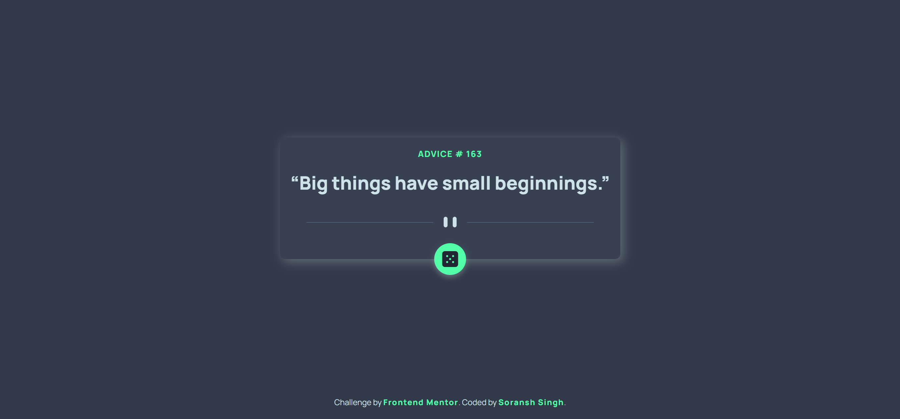

# Frontend Mentor - Advice generator app solution

This is a solution to the [Advice generator app challenge on Frontend Mentor](https://www.frontendmentor.io/challenges/advice-generator-app-QdUG-13db).

 Frontend Mentor challenges help you improve your coding skills by building realistic projects.

## Table of contents

- [Overview](#overview)
  - [The challenge](#the-challenge)
  - [Screenshot](#screenshot)
  - [Links](#links)
- [My process](#my-process)
  - [Built with](#built-with)
- [Author](#author)

## Overview

This is a simple advice generator app which fetches the slip from [Advice Slip JSON API](https://api.adviceslip.com/)
and render the advice.

### The challenge

Users should be able to:

- See random advices
- click on button to fetch new random advice

### Screenshot

### Links

- Solution URL: [Advice Generator || using ReactJs and CSS](https://www.frontendmentor.io/solutions/advice-generator-using-reactjs-and-css-fDdryjMNC)
- Live Site URL: [advise-generator.vercel.app](https://advise-generator.vercel.app/)

## My process

### Built with

- [React](https://reactjs.org/) - JS library
- Asynchronous js - Async/Await/Fetch
- CSS custom properties
- Mobile-first workflow

## Author

- Website - [Soransh Singh](https://soransh-singh.github.io/)
- Frontend Mentor - [@soransh-singh](https://www.frontendmentor.io/profile/soransh-singh)
- Twitter - [@SinghSoransh](https://twitter.com/SinghSoransh)
